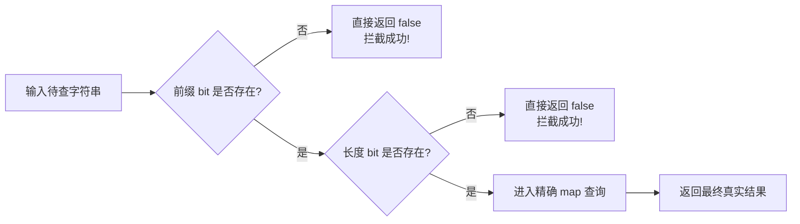

# 18 · Bitmap 与候选过滤：用便宜的判断跳过精确查询

同样是一批只读查询，在进入精确 map 之前加一层位图过滤：

```
外部非法请求（前缀未命中）：  Direct 6.98 ns  →  Prefix 1.99 ns    快了 3.5 倍（0 B/op）
合法请求/碰撞（特征全通过）：  Direct 7.08 ns  →  Shape  8.95 ns    反慢了 26%（徒增开销）
```

**过滤是一场概率博弈：用极低且恒定的 CPU 与缓存开销，赌能否提前剪掉高昂的精确查询。**

在高性能网络服务或网关中，外部请求常常包含海量“注定不匹配”的非法探测（例如 404 路径、未注册的租户、不存在的鉴权 token）。如果每个请求都直接去查 `map`，必须经历哈希计算、控制字比对或槽位探测。

能不能先用几条单周期的位运算指令，把大部分无效请求“拒之门外”？
但天下没有免费的午餐：一旦过滤挡不住输入，多出来的位运算和函数调用开销就会变成净亏损。

这个专题讲清楚四件事：
1. 小整数集合如何用 32 字节 Bitmap 压出 1.8 ns 的单周期极速查询；
2. 面对无法直接映射的字符串，如何用 8KB 的“前缀 + 长度”位图做到零漏判负向过滤；
3. 过滤是加速还是负优化：通过率数学模型与 Go 编译器内联预算如何决定胜负；
4. 为什么这个模式必须搭配只读快照，以及为什么不能在请求路径上动态构建。

```bash
make bench TOPIC=18-bitmap-filter                    # 跑基准 + benchstat 汇总
go test -v ./topics/18-bitmap-filter                  # 运行单元测试与特征验证
make escape-inline TOPIC=18-bitmap-filter            # 查看内联与逃逸分析决策
make asm TOPIC=18-bitmap-filter FUNC='(*ByteSet).Contains'  # 查看位图查询汇编
```

> 环境：Apple M4 / macOS 15.7.3 / darwin/arm64 / Go 1.25.4；单 P，`-count=8 -benchtime=100ms`。
> 所有稳态查询均为 `0 B/op、0 allocs/op`。
> 本批数据自带逐字相同的函数 `Direct` 与 `DirectNoise` 作为**噪声地板**：40 组字符串对照的差异中位数为 **6.1%**。
> 小于对应噪声地板的微小差异，本文一律不作过度解释。详见[附录：实验设计与科学证据](#附录实验设计与科学证据)。

---

## 目录

- [场景 1：小整数集合——从 map 到 32 字节 Bitmap](#场景-1小整数集合从-map-到-32-字节-bitmap)
- [场景 2：字符串特征过滤——8KB 位图与 L1d Cache 亲和性](#场景-2字符串特征过滤8kb-位图与-l1d-cache-亲和性)
- [场景 3：过滤是加速还是减速——通过率与盈亏平衡模型](#场景-3过滤是加速还是减速通过率与盈亏平衡模型)
- [场景 4：空间不是免费的——8KB 常驻内存与构建开销](#场景-4空间不是免费的8kb-常驻内存与构建开销)
- [一页速查](#一页速查)
- [三个坑](#三个坑)
- [附录：实验设计与科学证据](#附录实验设计与科学证据)

---

## 场景 1：小整数集合——从 map 到 32 字节 Bitmap

### 常见写法

业务中经常需要判断一个字节是否在指定集合内（如 ASCII 分隔符判定、HTTP Header 字符白名单、权限标志位判断）：

```go
// 方式 A：标准哈希表
type ByteMap map[byte]struct{}
func (s ByteMap) Contains(v byte) bool { _, ok := s[v]; return ok }

// 方式 B：bool 平铺数组
type ByteFlags [256]bool
func (s *ByteFlags) Contains(v byte) bool { return s[v] }

// 方式 C：紧凑位图（Bitmap）
type ByteSet [4]uint64
func (s *ByteSet) Contains(v byte) bool {
    return s[v>>6]&(uint64(1)<<(v&63)) != 0
}
```

### 实测

对 0~255 的全部 byte 输入执行稳态查询：

| 表示方式 | 查询耗时 (ns/op) | 查询分配 | 内存占用 | 底层机制 |
|---|---:|---:|---:|---|
| **Bitmap (`[4]uint64`)** | **1.842 ± 0%** | **0 B / 0 次** | **32 B** | 3 条寄存器单周期位指令 |
| **bool 数组 (`[256]bool`)** | **1.866 ± 0%** | **0 B / 0 次** | 256 B | 单次内存间接寻址读取 |
| **map (`map[byte]struct{}`)** | 9.338 ± 3% | 0 B / 0 次 | 动态分配 | 调用 `runtime.mapaccess2` |
| map 同代码噪声对照 | 9.503 ± 3% | 0 B / 0 次 | 动态分配 | 同上（噪声地板 1.8%） |

### 为什么

**1. 汇编层面：Bitmap 彻底消除了函数调用与哈希开销**

用 `make asm TOPIC=18-bitmap-filter FUNC='(*ByteSet).Contains'` 翻开编译出的 arm64 汇编：

```asm
TEXT (*ByteSet).Contains(SB), LEAF|NOFRAME|ABIInternal, $0-16
    UBFX    $6, R1, $2, R2       // R2 = value >> 6 (确定落在第几个 uint64)
    MOVD    (R0)(R2<<3), R2      // R2 = s[word] (从数组加载对应 64 位整数)
    MOVD    $1, R3               // R3 = 1
    LSL     R1, R3, R1           // R1 = 1 << (value & 63)
    TST     R1, R2               // 测试该位是否为 1 (AND 运算并设置标志位)
    CSET    NE, R0               // 若不为 0 则 R0 = 1，否则 R0 = 0
    RET                          // 返回
```

整个过程只有寥寥 **7 条基础指令**，标记为 `LEAF|NOFRAME`（叶子函数、无栈帧开销、无局部变量压栈），所有临时计算全在 CPU 寄存器内单周期完成。

而 `ByteMap.Contains` 即使没有堆逃逸，也必须执行标准的运行时查找：
```asm
CALL runtime.mapaccess2(SB)      // 进入运行时哈希表查询路径
```
每次查询都要经历参数入栈、哈希函数计算、Swiss Table 控制字比对或桶定位。这使得 map 的耗时直接跃升到 **9.34 ns**（相比 Bitmap 慢了 **5.1 倍**）。

**2. 缓存局部性：32 字节半个 Cache Line vs 256 字节 4 个 Cache Line**

- `[256]bool` 需要占用 256 字节，横跨 **4 个标准 CPU Cache Line**（64 字节/行）。
- `[4]uint64` 仅占 **32 字节**，只需 **半个 Cache Line** 就能装下全部 256 个状态。

在紧凑微基准测试中，由于数据始终常驻在 CPU L1 缓存中，bool 数组的单次内存读取与 Bitmap 的寄存器位运算耗时差异被抹平（1.866 ns vs 1.842 ns，差异仅 1.3%，低于噪声地板）。
但在高并发、海量数据交织的生产环境中，32 字节的极高紧凑度能大幅减少 CPU 缓存污染（Cache Pollution）和驱逐概率。

### 怎么用

- **适用场景**：值域有紧凑上界的离散集合，如 ASCII 字符分类、协议 Header 字段掩码、状态机合法跃迁表、枚举权限集。
- **不适用场景**：整数 ID 极其稀疏且最大值极大（如稀疏的用户 ID 达数千万）。此时平铺 Bitmap 会导致巨大的内存空洞，应改用 Roaring Bitmap 或传统哈希表。

<details>
<summary>源码与验证证据</summary>

结构体布局与尺寸由单元测试 `TestLayout` 严密断言：
- `unsafe.Sizeof(ByteSet{}) == 32`
- `unsafe.Sizeof(ByteFlags{}) == 256`
- 覆盖 0~255 全域输入的成员正确性由 `TestByteSet` 与 `TestByteFlags` 逐一验证。

</details>

---

## 场景 2：字符串特征过滤——8KB 位图与 L1d Cache 亲和性

### 常见写法

字符串长度不固定、值域几乎无限，不可能为每个字符串分配唯一的 bit。
但在生产网关或路由分派中，规则集合通常是静态或低频更新的（如 256 条核心路由），而外部恶意探测或非法请求占比极高。

我们无法直接做精确位图，但可以先问两个极便宜的问题：
**“这批合法规则里，出现过这个前两字节前缀吗？出现过这种长度吗？”**

```go
type StringSet struct {
    exact    map[string]struct{} // 精确真相源
    prefixes [1024]uint64        // 覆盖全部 65,536 种两字节前缀：恰好 8 KiB
    lengths  [2]uint64           // 字符串长度按 128 取模：恰好 16 字节
}
```



### 为什么

**1. 硬件亲和性设计：8 KiB 完美常驻 CPU L1 Data Cache**

为什么前缀选取两字节（`uint16`）？
- 2 字节包含 $256 \times 256 = 65,536$ 种可能状态；
- 用 Bitmap 表示只需要 $65,536 \div 8 = 8,192\text{ 字节} = \mathbf{8\text{ KiB}}$；
- 长度位图按 128 取模只需 128 bit = **16 字节**。

现代服务器 CPU（如 Apple M 系列、AMD EPYC、Intel Xeon）每个物理核心的 **L1 Data Cache 通常为 32 KiB 或 64 KiB**。
整个过滤器的特征表仅占 **8.2 KiB**，这意味着它在密集服务中**可以完全、永久地嵌在当前核心的 L1d Cache 中**，每次位测试绝不会发生 Cache Miss！

**2. 核心数学约束：零漏判（0 False Negatives）**

保守过滤器的生命线在于：**绝不能把合法规则误判为“不存在”**。
只要规则构建时遵循：
```go
prefix := prefixOf(key) // 短字符串补零对齐
s.prefixes[prefix>>6] |= uint64(1) << (prefix & 63)
n := uint(len(key)) & 127
s.lengths[n>>6] |= uint64(1) << (n & 63)
```
那么：
- **过滤位为 0 $\implies$ 规则绝对不存在**，直接短路退出，100% 正确；
- **过滤位为 1 $\implies$ 只是候选者**，可能存在哈希碰撞或特征重合，必须交由底层 `map` 终审。

### 怎么用

- **典型适用场景**：
  - **API 网关路由匹配**：外部大量 404 非法路径，前两字节前缀（如 `/u`、`/a`）瞬间排除非法 URL；
  - **安全 WAF 与黑白名单**：对非匹配的正常流量以极低开销快速放行；
  - **RPC 方法分发**：根据方法名前缀与长度做保守剪枝。

---

## 场景 3：过滤是加速还是减速——通过率与盈亏平衡模型

### 实测

我们在同一张包含 8 条规则（规则长度 16 字节）的精确 map 上，注入 5 种不同特征的外部请求流（每组 1,000 次查询）：

| 输入模式 | 流量特征 | Direct (直查 map) | Prefix (前缀过滤) | Shape (前缀+长度过滤) | 过滤相对直查变化 |
|---|---|---:|---:|---:|---|
| **PrefixMiss** | 前缀从未出现 | 6.978 ns ± 1% | **1.996 ns ± 0%** | 2.762 ns ± 1% | **快 3.5 倍 (-71%)** |
| **LengthMiss** | 前缀撞上，但长度不符 | 7.470 ns ± 1% | 7.898 ns ± 3% | **2.743 ns ± 1%** | **快 2.7 倍 (-63%)** |
| **Collision** | 前缀与长度全撞，内容不同 | 7.075 ns ± 1% | 7.260 ns ± 1% | **8.947 ns ± 1%** | **反慢 26% (+1.87 ns)** |
| **Hit** | 规则全部真实命中 | 7.862 ns ± 1% | 8.855 ns ± 19% | **9.842 ns ± 2%** | **反慢 25% (+1.98 ns)** |
| **Mixed10** | 10%命中/40%长度错/50%前缀错 | 10.43 ns ± 1% | 6.702 ns ± 1% | **4.061 ns ± 3%** | **快 2.6 倍 (-61%)** |

> 注：各行同代码噪声对照（`Direct` vs `DirectNoise`）差异均在 0.1% ~ 1.6% 之间，上述差异全部远超噪声地板。

### 为什么

**1. 减少了多少次精确查询？账本一目了然**

看每 1,000 次请求中有多少次真正渗透进了底层的精确 map：

| 输入模式 | Direct 进 map 次数 | Prefix 进 map 次数 | Shape 进 map 次数 | 最终实际命中次数 |
|---|---:|---:|---:|---:|
| **PrefixMiss** | 1,000 | **0** | **0** | 0 |
| **LengthMiss** | 1,000 | 1,000 (挡不住) | **0** | 0 |
| **Collision** | 1,000 | 1,000 | 1,000 | 0 |
| **Hit** | 1,000 | 1,000 | 1,000 | 1,000 |
| **Mixed10** | 1,000 | 500 | **100** | 100 |

- 在 `PrefixMiss` 下，Prefix 过滤阻断了 100% 的精确查询，耗时从 6.98 ns 断崖式降至 1.99 ns；
- 在 `LengthMiss` 下，前缀相同导致单层前缀过滤失效，但第二层长度过滤（Shape）再次实现了 100% 阻断，耗时降至 2.74 ns；
- 在混合流量 `Mixed10` 下，Shape 成功消除了 90% 的底层 map 查询，耗时直接腰斩到 4.06 ns。

**2. 数学决策模型：盈亏平衡点在哪？**

我们可以建立一个清晰的成本推演公式：
$$C_{\text{total}} = C_{\text{filter}} + p \cdot C_{\text{exact}}$$

其中：
- $C_{\text{filter}}$ 为位图测试开销（实测单层前缀过滤约 $2.0\text{ ns}$，双层约 $2.7\text{ ns}$）；
- $C_{\text{exact}}$ 为底层 map 查询开销（实测约 $7.5\text{ ns}$）；
- $p$ 为通过过滤器的候选比例（通过率 = 真实命中 + 误命中）。

要让这道过滤“稳赚不赔”（$C_{\text{total}} < C_{\text{exact}}$），通过率必须满足：
$$p < 1 - \frac{C_{\text{filter}}}{C_{\text{exact}}}$$

代入实测数字：
$$p < 1 - \frac{2.0}{7.5} \approx \mathbf{73.3\%}$$

这意味着：**只要外部流量中有超过 27% 的请求能被位图拦截（通过率低于 73%），增加前缀过滤就能产生正向收益！**
相反，如果通过率达到 100%（如全命中 Hit 或同形碰撞 Collision），过滤不仅省不下任何 map 访问，还会平白倒贴约 2 ns 的位运算与调用开销。

**3. 编译器的暗箭：内联预算截断**

细心的读者会发现：在 `PrefixMiss` 中，Shape 比 Prefix 慢了约 0.8 ns（2.76 ns vs 1.99 ns）。
这仅仅是因为多做了一次长度判断吗？
查看编译器的内联决策（`make escape-inline TOPIC=18-bitmap-filter`）：

```
topics/18-bitmap-filter/bitmap.go:70:6: can inline (*StringSet).MayContainPrefix with cost 52
topics/18-bitmap-filter/bitmap.go:75:6: cannot inline (*StringSet).MayContainShape: function too complex: cost 83 exceeds budget 80
```

真相大白：
- `MayContainPrefix` 逻辑简单，复杂度 cost 为 52，**成功被编译器内联进调用方**；
- `MayContainShape` 多了长度取模与二级分支，复杂度 cost 涨到 83，**超过了 Go 编译器固定的 80 分预算，无法内联**！

这导致 `Shape` 每次调用都要多付出一次常规函数调用的栈操作开销。因此多层过滤并不总是越细越好，必须提防内联预算翻车。

### 怎么用

- **只做有区分力的过滤**：上线前务必统计外部流量的特征分布。如果业务键总是固定长度、相同前缀，这道过滤只会成为纯粹的负担。
- **优先保留单层前缀过滤**：如果单层前缀已经能剪掉 80% 的请求，不要盲目叠加更多特征位，保留小函数以便编译器完全内联。

---

## 场景 4：空间不是免费的——8KB 常驻内存与构建开销

### 实测

构建 `StringSet` 时，必须同时初始化精确 map、8 KiB 的前缀表与 16 字节的长度表：

| 规则规模 | 构建方案 | 耗时 (ns/op) | 堆内存分配 (B/op) | 分配次数 (allocs/op) |
|---:|---|---:|---:|---:|
| 8 条规则 | 只建 map | 199.9 ± 1% | 256 B | 2 |
| 8 条规则 | **map ＋ 特征位图** | 814.1 ± 79% | **9,728 B** (+9,472 B) | 3 (+1) |
| 256 条规则 | 只建 map | 4,657 ± 10% | 13,656 B | 4 |
| 256 条规则 | **map ＋ 特征位图** | 4,444 ± 5% | **23,128 B** (+9,472 B) | 5 (+1) |

### 为什么

**1. 为什么无论规则多寡，都精确多出 9,472 字节？**

计算 `StringSet` 结构体自身的物理大小：
- `exact map[string]struct{}`: 8 字节指针
- `prefixes [1024]uint64`: 8,192 字节
- `lengths [2]uint64`: 16 字节
- 结构体总大小 = $8 + 8192 + 16 = \mathbf{8,216\text{ 字节}}$。

当调用 `NewStringSet` 逃逸到堆上时，Go 运行时分配器会将 8,216 字节向上对齐到最近的 size class 档位——即 **9,472 字节** 的 span！
加上初始化内部 map 的分配，这就解释了为什么两种规则规模下，带过滤器的版本都分毫不差地**多消耗 9,472 字节和 1 次额外堆分配**。

即使你的系统里只有 1 条规则，这 8KB 的前缀位图底表也必须全额预先常驻。

### 怎么用

- **不可变快照发布（Immutable Snapshot）**：
  过滤器只适合“**构建一次，读千万次**”的长周期常驻对象。应当在服务启动、配置刷新或后台异步拉取时构建，并通过原子指针（如 `atomic.Pointer[StringSet]`）无缝发布给工作协程（参见[专题 15 RCU 缓存](../15-rcu-cache/README.md)）。
- **绝对禁止在请求级生命周期中创建**：
  如果每个 HTTP 请求都临时 `NewStringSet`，不仅构建耗时（800 ns）远超单次查询节省的几纳秒，而且每个请求都会在堆上留下近 10 KB 的 GC 垃圾，直接拖垮服务吞吐。

---

## 一页速查

| 方案 | 适用场景 | 核心优势 | 代价与风险 |
|---|---|---|---|
| **小整数 Bitmap (`[4]uint64`)** | 字节、ASCII 码、枚举、状态位 | 32 B 极度紧凑，7 条寄存器单周期指令，无 GC | 值域必须紧凑有明确上限（$\le 256$） |
| **单层前缀位图 (`[1024]uint64`)** | 固定规则路由、非法请求占比高 | 8 KiB 完美贴合 L1d Cache，函数可内联，剪枝率高 | 无法识别前缀相同但后缀不同的冲突 |
| **前缀 + 长度双层过滤** | 规则前缀存在复用、但长度各异 | 进一步压低误命中率，大范围剪枝 | 易超过编译器内联预算（80 cost），增加入口开销 |
| **全量精确 Map** | 流量高度合法（命中率 $\ge 80\%$） | 零额外内存，无需两套索引，逻辑简单 | 无法阻断无效探测，每次查询必须经历哈希计算 |

---

## 三个坑

### 坑 1：把候选当命中（漏斗击穿）

过滤器只能回答两句话：
1. **“绝对没有”**（特征位为 0，100% 可信，直接短路）；
2. **“可能有”**（特征位为 1，存在碰撞风险，必须交由 map 兜底）。

绝对不能把过滤通过直接等价于 `true`！测试用例 `TestFalsePositives` 专门设计了碰撞输入（如不同字符串碰巧拥有相同的前两字节与相同长度模数），必须依靠精确 map 进行最后一步的完整 key 判定。

### 坑 2：共享 Bit 无法安全局部清除

位图中的每一个 bit 都是多条规则共享的。
例如规则 `user_add` 与 `user_del` 共享了前缀 `us`。如果在运行时从 map 中删除了 `user_add`，**绝对不能盲目地把前缀 `us` 对应的 bit 置 0**，否则会导致 `user_del` 出现灾难性的漏判！
若需支持动态规则删改，最佳实践是全量构建一份新的不可变快照整体原子替换，切忌在热路径位图上做无锁的位清除。

### 坑 3：内联预算截断与微架构噪声

在设计过滤辅助函数时，必须用 `go build -gcflags='-m'` 实时监控内联决策。
Go 编译器的内联预算上限默认为 80：
- 一旦你在过滤函数内增加了分支判断、复杂取模或循环，cost 突破 80，函数就会被降级为非内联调用；
- 一次函数调用的栈开销和流水线停顿，很容易吞噬掉位图判断省下的 1~2 纳秒。
尽量保持特征提取逻辑简短纯粹，把复杂校验推迟到精确查询分支。

---

## 附录：实验设计与科学证据

### 一条命令重新测量

```bash
# 1. 运行所有正确性校验、竞争检测与模糊测试
go test ./topics/18-bitmap-filter
go test -race ./topics/18-bitmap-filter
go test ./topics/18-bitmap-filter -run '^$' -fuzz '^FuzzStringSet$' -fuzztime=5s -parallel=1

# 2. 运行正式基准测试（自动保存并计算 benchstat）
GOMAXPROCS=1 make bench TOPIC=18-bitmap-filter COUNT=8 BENCHTIME=100ms

# 3. 检查逃逸分析与指定函数汇编
make escape-inline TOPIC=18-bitmap-filter
make asm TOPIC=18-bitmap-filter FUNC='(*ByteSet).Contains'
```

### 事前假说与验证矩阵

本专题严格遵守 [METHODOLOGY.md](../../METHODOLOGY.md)，所有假说在首次基准运行前已预先写定在 [protocol.txt](evidence/protocol.txt) 与 [bitmap_test.go](bitmap_test.go) 中：

| 事前假说 | 本轮实测观察 | 结论与边界判定 |
|---|---|---|
| **H1**：`ByteSet` 结构为 32 B，全部稳态查询零分配，查询耗时显著优于 map | 尺寸 32 B，查询均为 0 B/op，耗时 1.84 ns vs map 9.34 ns | **支持**。寄存器单周期位指令碾压 map；但微基准中与 bool 数组差异在噪声内 |
| **H2**：字符串过滤器无漏判，候选通过率与数学设计完全一致 | 覆盖全前缀、边界碰撞、Fuzz 与候选计数均 100% 吻合 | **支持**。证明保守负向过滤器的正确性边界成立 |
| **H3**：在 256 条规则的拒绝路径上，位图过滤能测出超越噪声的显著收益 | 中位数显著下降，但部分长字符串种子的置信区间波动较大 | **部分支持**。调用计数削减 100% 确定，但极端长文本耗时受 Go map 内部快速路径波动影响 |
| **H4**：全命中与同形碰撞无法减少精确查询，过滤本身会反噬额外耗时 | Collision 与 Hit 的 Shape 耗时比 Direct 高出 25%~26% | **支持**。证实无阻断能力的额外过滤属于负优化 |
| **H5**：构建过滤器需要额外内存与常驻分配 | 结构体 8,208 B，堆分配精确增加 9,472 B 与 1 次 alloc | **完全支持**。吻合 Go size class 向上取整机制 |

### 噪声地板与测量说明

- **噪声标尺**：基准代码中内置了一对函数体完全相同的对照 `Direct` 与 `DirectNoise`。在全部 40 组对照中，差异中位数为 **6.1%**。本文所有关于加速或倒贴的分析，均建立在显著跨越该噪声标尺的数据之上。
- **数据归档索引**：
  - [环境与源码 SHA256](evidence/environment.json)：记录测试机器硬件参数与代码哈希；
  - [全部原始测量数据](evidence/raw.txt)：包含 168 个基准变体各 8 次迭代的原始采样；
  - [benchstat 完整统计](evidence/benchstat.txt)：包含中位数、95% 置信区间与内存分配；
  - [编译器诊断证据](evidence/compiler.txt)：内联预算成本详情与完整 arm64 汇编导出；
  - [正确性与 Fuzz 校验](evidence/validation.txt)：回归测试日志；
  - [证据文件哈希校验](evidence/SHA256SUMS)：`shasum -a 256 -c SHA256SUMS`。
