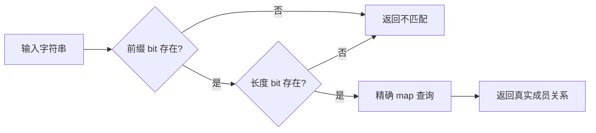

# 专题 18：Bitmap——用便宜的判断跳过精确查询

**Bitmap 的价值取决于它能省掉什么工作。** 对 byte 集合，它可以直接回答成员关系；
对字符串集合，它可以先排除不可能匹配的输入，再把候选交给精确查询。
这两种用法共享位操作，正确性保证却不同。

本专题用纯 Go 实现，不依赖业务框架。我们分别测量整数集合、字符串候选过滤和
过滤器构建，重点看：过滤能挡住多少查询、挡不住时付出什么成本，以及何时值得采用。

> 环境：Apple M4 / macOS 15.7.3 / darwin/arm64 / Go 1.25.4；单 P，
> `-count=8 -benchtime=100ms`。全部查询变体均为 `0 B/op、0 allocs/op`。
> **本轮时间数据有明显噪声：40 组字符串同代码对照的差异中位数为 6.1%，
> 最大为 128.8%。** 下文按具体输入报告中位数和 benchstat 波动，
> 不从整批结果宣称统一加速倍数。

## 目录

- [1. 一个 bit 可以精确表示一个整数](#1-一个-bit-可以精确表示一个整数)
- [2. 字符串特征只能筛候选](#2-字符串特征只能筛候选)
- [3. 多一道过滤是否划算取决于通过率](#3-多一道过滤是否划算取决于通过率)
- [4. 构建和常驻内存也属于成本](#4-构建和常驻内存也属于成本)
- [一页速查](#一页速查)
- [坑：过滤器最容易错在正确性与测量边界](#坑过滤器最容易错在正确性与测量边界)
- [附录：实验设计与可复现证据](#附录实验设计与可复现证据)

## 1. 一个 bit 可以精确表示一个整数

假设输入是一个 byte，取值范围固定为 0—255。用 `map[byte]struct{}` 表示集合，
每次查询都要进入 map 查询路径。换成 `[256]bool` 可以直接索引；再把每个 bool
压成一个 bit，就得到 `[4]uint64`。

```go
word := value >> 6                     // value / 64
mask := uint64(1) << (value & 63)      // word 内的位置
set[word] |= mask                     // 加入集合
present := set[word]&mask != 0        // 查询集合
```

每个整数对应唯一的 bit，所以这种 bitmap 没有误命中。
[ByteSet](bitmap.go) 的类型本身限定输入范围，查询不需要额外的越界处理。

| 表示方式 | 查询耗时，ns/op | 查询分配 | 固定载荷 |
|---|---:|---:|---:|
| Bitmap | 1.842 ± 0% | 0 B / 0 次 | 32 B |
| bool 数组 | 1.866 ± 0% | 0 B / 0 次 | 256 B |
| map | 9.338 ± 3% | 0 B / 0 次 | 非固定数组，未单独测驻留大小 |
| map 同代码噪声对照 | 9.503 ± 3% | 0 B / 0 次 | 同上 |

本组噪声对照中位数相差 **1.8%**，bitmap 与 bool 数组相差约 **1.3%**，
因此本实验不声称 bitmap 查询比 bool 数组快。`±0%` 是 benchstat 的舍入显示，
不意味着完全没有波动。

这里要分别看空间和时间。Bitmap 的载荷是 **32 B**，bool 数组是 **256 B**，
空间缩小八倍；但 bool 数组只需一次索引读取，bitmap 还需要移位和掩码。
不能把“更紧凑”直接推导成“每次查询一定更快”。两者在本实验中都很小，
没有测试多份大集合造成的缓存压力。

**怎么用：** 值域小且有明确上界时，bitmap 适合表示权限、字符分类、状态集合。
如果整数 ID 极其稀疏且最大值很大，按最大值分配的 bitmap 可能浪费内存；
本例不能推导出它优于哈希集合或压缩 bitmap。

<details>
<summary>源码与编译器证据</summary>

`ByteSet.Contains` 在本次 arm64 编译产物中保留了移位、加载和位测试，
没有 map 调用；`ByteFlags.Contains` 是索引读取。
`ByteMap.Contains` 则调用 `runtime.mapaccess2`。
查询结果在基准结束时写入包级变量，查询函数标记 `//go:noinline`。
这使测量聚焦于未内联的调用路径，不能直接当作业务代码完全内联后的成本。

精确结构尺寸由 `TestLayout` 验证，全部 256 个输入由 `TestByteSet` 验证。

</details>

## 2. 字符串特征只能筛候选

字符串无法直接映射到一个小型精确 bitmap。可以先问更便宜的问题：
**规则里出现过这个前缀和长度吗？**

本例使用两个特征：

| 特征 | 编码 | 占用 |
|---|---|---:|
| 前两个字节 | `uint16(key[0])<<8 \| uint16(key[1])` | 65,536 bit，即 8 KiB |
| 字节长度 | `len(key) & 127` | 128 bit，即 16 B |

短字符串的前缀补零，避免访问不存在的字节。长度取模会让 4 和 132 落到同一个 bit。
这些碰撞都只增加候选，不影响最终查询结果。



关键约束是：**每条精确规则都必须设置对应的特征位。**
只要规则和过滤器来自同一批输入，规则存在就一定通过过滤；
过滤未通过，可以直接返回 false；过滤通过，还不能返回 true。

本例的前缀与长度分别索引。例如规则只有 `aa12` 和 `bb12345`，
那么 `aa12345` 的两个特征都存在，依然会成为候选。
如果业务需要降低这种误命中，可以为不同前缀分别保存长度集合，
但会增加存储或索引复杂度。本专题保留简单表示，方便隔离机制。

这也区别于通常所说的 Bloom filter：这里直接索引业务特征，没有使用多个哈希函数，
误命中取决于输入特征分布，不能套用 Bloom filter 的误判率公式。

**怎么用：** 适合固定规则较多、外部输入大量不匹配，而且前缀或长度有区分力的路径，
例如字段匹配、协议分派、解析器候选筛选。它不会替代最终的精确规则判断。

## 3. 多一道过滤是否划算取决于通过率

同一份精确 map 上比较四个入口：

| 入口 | 变化 |
|---|---|
| `Direct` | 直接查询精确 map |
| `DirectNoise` | 与 Direct 函数体相同，用于测量噪声 |
| `Prefix` | 前缀未出现就返回，否则查询同一份 map |
| `Shape` | 前缀、长度依次过滤，通过后查询同一份 map |

下面先不看时间，直接数每 1,000 次请求有多少次会执行精确查询。
这些计数由测试核对，计数逻辑没有放进计时循环。

| 输入 | Direct | Prefix | Shape | 实际命中 |
|---|---:|---:|---:|---:|
| PrefixMiss：前缀不存在 | 1,000 | 0 | 0 | 0 |
| LengthMiss：前缀存在，长度不同 | 1,000 | 1,000 | 0 | 0 |
| Collision：前缀和长度相同，内容不同 | 1,000 | 1,000 | 1,000 | 0 |
| Hit：全部命中 | 1,000 | 1,000 | 1,000 | 1,000 |
| Mixed10：10% 命中、40% 长度不符、50% 前缀不符 | 1,000 | 500 | 100 | 100 |

### 能排除的查询越多，过滤越有机会回本

下面展示实验矩阵中的第一组输入：**8 条规则、16 字节、seed=7**。
选择这一固定位置用于讲机制；其他规模和种子全部保留在证据中，不用这组替代整批结论。
单位为 ns/op，`±` 为 benchstat 默认 95% 置信区间的相对幅度显示。

| 输入 | Direct | Prefix | Shape | 同代码对照差异 |
|---|---:|---:|---:|---:|
| PrefixMiss | 6.978 ± 1% | 1.996 ± 0% | 2.762 ± 1% | 0.6% |
| LengthMiss | 7.470 ± 1% | 7.898 ± 3% | 2.743 ± 1% | <0.1% |
| Collision | 7.075 ± 1% | 7.260 ± 1% | 8.947 ± 1% | 1.4% |
| Hit | 7.862 ± 1% | 8.855 ± 19% | 9.842 ± 2% | 1.6% |
| Mixed10 | 10.43 ± 1% | 6.702 ± 1% | 4.061 ± 3% | 0.2% |

在这组输入中，PrefixMiss 的 Prefix 和 LengthMiss 的 Shape 都减少了精确查询，
耗时差异也超过对应噪声对照。Hit 的 Prefix 自身波动达到 19%，
不据其约 13% 的中位数差异下结论。

PrefixMiss 展示前缀过滤的作用，LengthMiss 单独展示新增长度过滤的作用。
Mixed10 则把二者放在一个打乱顺序的输入流中，避免只测一个永远走相同分支的字符串。

可以用一个粗略成本模型理解结果：

```text
直接查询 ≈ C_exact
先过滤   ≈ C_filter + p × C_exact_given_pass
```

`p` 是过滤器通过率，包含真实命中和误命中。
若通过后的查询成本近似等于原来的平均查询成本，才可以进一步近似为：
`C_filter < (1-p) × C_exact` 时值得过滤。
实际中命中和不命中的成本可能不同，最终仍要测真实输入。

### 过滤挡不住输入时，额外判断可能成为负担

同一组 Collision 输入中，Shape 为 **8.947 ns/op**，Direct 为 **7.075 ns/op**；
全命中的 Hit 中，Shape 为 **9.842 ns/op**，Direct 为 **7.862 ns/op**。
这两个局部对照展示了额外过滤成为负担的情况，不能外推到其他规则分布。

同时，256 条规则、16 字节、seed=7 的 Hit 中，两个完全相同的入口却测得
**7.519 与 17.20 ns/op**，相差 **128.8%**。这一行的策略排名证据不足。
该规模同种子的 PrefixMiss/Shape 甚至出现 **±165%** 的区间，
即使中位数较小，也不把它当作可靠收益。

Collision 和 Hit 都没有减少一次精确查询。
这类场景的差异还会受代码布局、缓存和分支预测影响；
小于同一输入的噪声对照差异时，本专题不解释性能排名。

**怎么用：** 上线前先观察候选通过率。低命中率并不等于低通过率——
Collision 的实际命中率为零，过滤通过率却是 100%。
如果真实字段总共享少数前缀和长度，增加这层过滤可能没有收益。

## 4. 构建和常驻内存也属于成本

规则已知时，可以提前构建 bitmap，在热路径里只读。
`NewStringSet` 同时建立精确 map 和特征位，避免手工维护两套名单。

| 规则数 | 构建方式 | 耗时，ns/op | B/op | allocs/op |
|---:|---|---:|---:|---:|
| 8 | 只建 map | 199.9 ± 1% | 256 | 2 |
| 8 | map＋过滤器 | 814.1 ± 79% | 9,728 | 3 |
| 256 | 只建 map | 4,657 ± 10% | 13,656 | 4 |
| 256 | map＋过滤器 | 4,444 ± 5% | 23,128 | 5 |

两种规模都多分配了 **9,472 B 和一个对象**，与过滤器对象的逃逸和堆分配一致。
256 条规则时过滤版的构建中位数稍小，但差异小于两侧波动，不能解释成构建更快。
8 条规则的过滤版构建时间也很不稳定，因此不据这批数据计算精确的回本查询次数。

两个 bitmap 共占 **8,208 B**。`StringSet` 还包含一个 map 引用，
本机结构尺寸为 **8,216 B**，不包含 map 内部存储。
堆分配会受 Go size class 等因素影响，不能直接用结构尺寸当作 `B/op`。

这个表示为完整双字节值域付出固定 8 KiB，即使规则只有几条。
对于大量独立的小规则集，常驻内存可能不可接受。
按实际前缀分配 ID、按域共享过滤器、缩小特征空间都可以继续研究，
但需要重新验证空间、访问成本和误命中率。

**怎么用：** 把构建放在配置加载或初始化阶段，多次复用。
本例不包含运行时更新接口。如果需要更新，构建新的完整快照后再发布；
不能只改 map 而让过滤器继续使用旧规则。

## 一页速查

| 场景 | 值得尝试 | 先检查 |
|---|---|---|
| 小且有界的整数集合 | 精确 bitmap 或 bool 数组 | 值域与密度、时间和空间分别比较 |
| 大量字符串前缀明显不匹配 | 前缀 bitmap | 拦截比例、固定表的内存成本 |
| 前缀相同但长度有区分力 | 增加长度 bitmap | 新增位测试是否能省掉足够多查询 |
| 前缀和长度几乎都一样 | 保留直接查询作对照 | 误命中会使过滤失效 |
| 规则频繁变化或只查几次 | 把构建也计入比较 | 初始化成本能否摊平 |
| 每个请求使用不同规则集 | 先评估共享或表示方式 | 本实验只测热的、重复使用的规则集 |

## 坑：过滤器最容易错在正确性与测量边界

**把候选当命中会返回错误结果。** `TestFalsePositives` 特意让不同字符串拥有相同特征。
它还覆盖不同前缀与长度的组合、长度模 128 的碰撞；精确 map 必须兜底。

**共享 bit 不能随便清除。** 删除一条规则时，其他规则可能仍依赖相同前缀或长度位。
直接清零可能制造漏判；保留过期 bit 只会增加误命中，或者可以重建快照。

**字符串长度和前缀都按字节处理。** 对 UTF-8，这不是字符数或前两个汉字。
过滤仍然正确，但区分力需要根据实际语料判断。

**过滤函数也受内联预算影响。** 本轮 Go 1.25.4 把 `MayContainPrefix` 内联了，
`MayContainShape` 的成本为 83，超过预算 80，没有内联。
Shape 相比 Prefix 既多了长度检查，也可能多一次调用。
因此这些时间不能解释成某条位运算指令的单独成本。

**规则规模和键长度会改变 map 自己的路径。** Go 1.25.4 的小型字符串 map
存在对长字符串的快速比较分支；本实验主要规则长度为 16/64 字节，
LengthMiss 会生成 17/65 字节的探针，后者可能跨过内部阈值。
不同长度间的差异不能全部归因于哈希字节数；只在同一行比较过滤策略。

**零分配不等于没有内存成本。** 本轮所有查询都是零分配，但过滤器构建明确多出
9,472 B。它们分别描述一次查询的增量分配和可复用结构的构建分配。

**噪声本身就是结果。** 预声明协议要求只跑一批、不选择性复测，本轮保留全部
1,344 条测量。高噪声输入保留为时间证据不足；不能丢掉最吵的种子再给出统一倍数。

## 附录：实验设计与可复现证据

### 一条命令重新测量

```bash
go test ./topics/18-bitmap-filter
go test -race ./topics/18-bitmap-filter
go test ./topics/18-bitmap-filter -run '^$' -fuzz '^FuzzStringSet$' -fuzztime=5s -parallel=1

# 正式测量命令；stdout/stderr 保存到 .bench/18-bitmap-filter.txt
go test ./topics/18-bitmap-filter -run '^$' -bench . -benchmem -cpu=1 -count=8 -benchtime=100ms

# 使用仓库统一入口，等价地限制 GOMAXPROCS：
GOMAXPROCS=1 make bench TOPIC=18-bitmap-filter COUNT=8 BENCHTIME=100ms
make escape-inline TOPIC=18-bitmap-filter
make asm TOPIC=18-bitmap-filter FUNC=NewStringSet
```

本轮实验按[仓库方法论](../../METHODOLOGY.md)预先写定假说，完整协议保存在
[protocol.txt](evidence/protocol.txt)，原始措辞也保留在 [bitmap_test.go](bitmap_test.go)。
这是通用教学实验，不把来源项目的端到端收益当作本专题的测量结果。

| 事前假说 | 本轮观察 | 结论边界 |
|---|---|---|
| H1：byte bitmap 为 32 B；各查询零分配 | 尺寸、全部输入和分配指标吻合 | 本机测量支持；不声称胜过 bool 数组的查询时间 |
| H2：无漏判，候选通过率符合设计 | 边界、全部前缀、候选计数、fuzz 和查询分配均符合 | 支持本实现与输入范围 |
| H3：256 条规则的拒绝路径可测得超出噪声的收益 | 有下降的中位数，但部分对应区间极大 | 整体时间预测证据不足，不能承诺稳定收益 |
| H4：全通过不减少精确查询，并可能回退 | 调用数不变；第一组 Collision/Hit 的 Shape 较慢 | 支持这两个局部反例，不能推广所有变体 |
| H5：构建额外位图需要空间和分配 | 位图 8,208 B；构建多 9,472 B、1 alloc | 空间和分配支持；构建时间不能统一排名 |

### 输入与计时边界

- 规则规模 8/256，规则字节长度 16/64，固定使用八种前缀。
- 每组输入 1,000 个字符串，两个固定种子仅改变访问顺序，不代表生产分布。
- 五种输入分别控制前缀不符、长度不符、同形误命中、全命中和混合分布。
- 每轮同一组策略使用同一个精确 map；Go map 的内部哈希 seed 不固定。
- 命中字符串通过 `strings.Clone` 独立构造，避免只靠同一字符串地址快速命中。
- `b.Loop` 排除输入与规则构建；每 op 查询一个 key，包含循环索引和函数调用成本。
- 单独的 Build 组测量创建完整结构，原始规则字符串在计时外生成。
- 八次重复全部保留；这是 Go benchmark 的顺序执行，未使用交错 A/B 调度。
- 噪声对照按每行分别计算，不能用最安静的一行替代所有输入。
- 未测冷缓存、大量规则集轮换、动态更新、并发写入、生产吞吐或 p99。

### 证据文件与源码定位

- [环境、命令与被测源码 SHA-256](evidence/environment.json)：记录未提交工作树的基准 revision 与准确文件内容。
- [全部原始测量](evidence/raw.txt)：168 个变体，各 8 次，包含噪声对照和构建测量。
- [benchstat 完整输出](evidence/benchstat.txt)：中位数、置信区间与分配数据。
- [机器可读汇总](evidence/summary.json)与[生成脚本](evidence/summarize.py)：保留每组样本数、最小值、最大值和中位数。
- [编译器证据摘录](evidence/compiler.txt)：构建逃逸、内联决策和完整查询函数汇编；本地工作区路径已替换成 `$REPO`。
- [正确性与回归日志](evidence/validation.txt)：单元测试、race、fuzz 与仓库检查。
- [证据文件 SHA-256](evidence/SHA256SUMS)：校验本轮归档文件。

```bash
python3 topics/18-bitmap-filter/evidence/summarize.py \
  topics/18-bitmap-filter/evidence/raw.txt > /tmp/bitmap-summary.json
benchstat topics/18-bitmap-filter/evidence/raw.txt
(cd topics/18-bitmap-filter/evidence && shasum -a 256 -c SHA256SUMS)
```

Go 运行时源码可在本机定位：

```bash
# Go 1.25.4：runtime_mapaccess2_faststr、getWithoutKeySmallFastStr
sed -n '1,100p' "$(go env GOROOT)/src/internal/runtime/maps/runtime_faststr_swiss.go"
sed -n '161,220p' "$(go env GOROOT)/src/internal/runtime/maps/runtime_faststr_swiss.go"
```

可与[专题 03：map 实现](../03-map-internals/README.md)连起来阅读：
Swiss Table 自己也利用短指纹筛选候选，最终仍需要比较完整 key。
本专题是在调用 map 前增加一层输入特征筛选，是否值得取决于它能额外排除多少工作。
