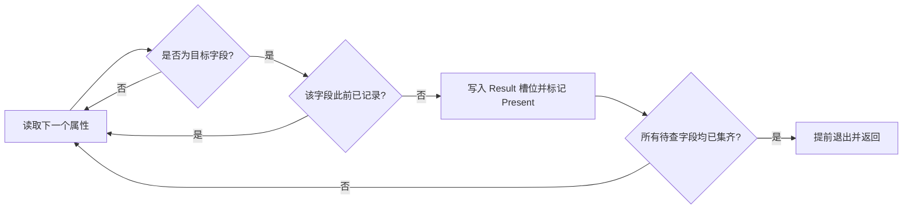

# 19 · 重复查找与一次扫描：先看容器，再决定要不要缓存

同样是一组固定字段的提取操作，面对不同的容器与消费场景：

```
线性切片（提取尾部 8 字段）：重复遍历 528.7 ns  →  单次扫描 160.2 ns    快了 3.3 倍（0 B/op）
线性切片（仅提取 1 尾部字段）：重复遍历  69.7 ns  →  单次扫描 191.2 ns    反而慢了 2.7 倍（过路费反噬）
原生 Map（仅提取 1 个字段）：  按键直查  39.3 ns  →  遍历整表 524.1 ns    暴慢 13.3 倍！
```

**优化查找不是盲目套用缓存或遍历算法，而是认清你的底层容器与字段消费模式。**

在微服务、API 网关与可观测系统（如 OpenTelemetry Span 属性、HTTP Header、gRPC 元数据、结构化日志 Tag）中，一条记录往往携带几十到上百个属性。
为了从中读取业务所需的关键字段，开发者的直觉往往走向两个极端：
- **直觉 A**：“不就取几个字段吗？写几个 `for` 循环遍历切片，每次 `get(key)` 查一下就行。”
- **直觉 B**：“切片查找太慢了，直接先 `make(map)` 把全部属性转成哈希表，查起来就是 $O(1)$！”

但这两种直觉在不同的访问深度与读取频次下，都会遭遇惨烈的性能翻车。

这个专题讲清楚五件事：
1. 线性切片在多字段提取时，$O(k \cdot n)$ 重复遍历为什么会演变成近千次比较的性能泥潭，而 $O(n)$ 单次扫描如何破解；
2. 为什么只取单一字段或字段靠前时，单次扫描的“状态管理过路费”反而会导致耗时暴增 2.7 倍；
3. 输入本来就是原生 Map 时，为什么 `for k, v := range m` 遍历是极度危险的负优化（比直接按键查慢 13 倍）；
4. 为什么在请求链路中每次临时“转 Map 建索引”是一场内存分配灾难（多花 11 倍耗时与近 10 KB 堆垃圾）；
5. 跨阶段流水线消费中，“单次提取强类型结构体（`Result`）并在上下文透传”如何彻底终结索引与重复查找。

```bash
make bench TOPIC=19-repeated-lookup                   # 跑基准 + benchstat 汇总
go test -v ./topics/19-repeated-lookup                 # 运行单元测试与访问计数验证
make escape-inline TOPIC=19-repeated-lookup           # 查看内联决策与逃逸分析
make asm TOPIC=19-repeated-lookup FUNC=MapScan        # 查看 map 迭代器汇编
```

> 环境：Apple M4 / macOS 15.7.3 / darwin/arm64 / Go 1.25.4；单 P，`-count=8 -benchtime=200ms`。
> 所有直接提取变体均为 `0 B/op、0 allocs/op`。
> 本批数据自带逐字相同的函数 `SliceRepeated` 与 `SliceRepeatedNoise` 等作为**噪声地板**：38 组同代码对照差异中位数为 **11.1%**。
> 小于对应噪声地板的微小差异，本文一律不作过度解释。详见[附录：假说、实验边界与证据](#附录假说实验边界与证据)。

---

## 目录

- [场景 1：线性切片多字段提取——O(k·n) 重复遍历 vs O(n) 单次扫描](#场景-1线性切片多字段提取okn-重复遍历-vs-on-单次扫描)
- [场景 2：单字段提取与头部命中——为什么单次扫描会反噬 2.7 倍？](#场景-2单字段提取与头部命中为什么单次扫描会反噬-27-倍)
- [场景 3：原生 Map 容器——按键定点直查 vs 错误的全表 range 扫描](#场景-3原生-map-容器按键定点直查-vs-错误的全表-range-扫描)
- [场景 4：动态建索引的陷阱——为什么每次转 Map 是一场性能灾难？](#场景-4动态建索引的陷阱为什么每次转-map-是一场性能灾难)
- [场景 5：跨阶段复用——单次提取结构体彻底终结重复查找与索引](#场景-5跨阶段复用单次提取结构体彻底终结重复查找与索引)
- [一页速查](#一页速查)
- [三个坑](#三个坑)
- [附录：假说、实验边界与证据](#附录假说实验边界与证据)

---

## 场景 1：线性切片多字段提取——O(k·n) 重复遍历 vs O(n) 单次扫描

### 常见写法

OpenTelemetry 属性切片、HTTP 请求头切片等常见结构：
```go
type Attribute struct{ Key, Value string }
```

当我们需要同时获取 8 个关键字段（如 `method`、`route`、`status`、`service`、`region`、`tenant`、`trace`、`user`）时，最容易写出的代码就是多次调用单独的 getter：

```go
// 方式 A：重复线性遍历 (SliceRepeated)
func SliceRepeated(attrs []Attribute, k int) Result {
    var out Result
    for i, key := range queryKeys[:k] {
        out.Values[i], out.Present[i] = get(attrs, key) // 每次从头遍历 attrs
    }
    return out
}

// 方式 B：单次扫描分派 (SliceScan)
func SliceScan(attrs []Attribute, k int) Result {
    var out Result
    remaining := k
    for _, attr := range attrs {
        i := slot(attr.Key) // 通过 switch 将 key 映射到 0~7 槽位 (可内联)
        if i < 0 || i >= k || out.Present[i] {
            continue
        }
        out.Values[i], out.Present[i] = attr.Value, true
        remaining--
        if remaining == 0 { break } // 找齐立刻提前退出
    }
    return out
}
```



### 实测

在包含 128 个属性的切片上，目标 8 个字段位于切片尾部（`layout=tail, k=8`）：

| 策略 | 查询耗时 (ns/op) | 堆内存分配 | 属性比较/访问总次数 | 算法复杂度 |
|---|---:|---:|---:|---|
| **重复线性查找 (`SliceRepeated`)** | 528.7 ± 1% | 0 B / 0 allocs | **996 次** | 最坏 $O(k \cdot n)$ |
| **单次扫描提取 (`SliceScan`)** | **160.2 ± 17%** | **0 B / 0 allocs** | **128 次** | 严格 $\le O(n)$ |
| **性能提升** | **快 3.3 倍 (-70%)** | 零分配 | **少跑 868 次访问** | 阶跃性降维 |

> 注：该行同代码对照（`SliceRepeated` vs `SliceRepeatedNoise`）差异仅为 0.8%，3.3 倍加速极其显著。

### 为什么

**1. 访问次数的真实账本：996 次 vs 128 次**

在 128 个属性且目标在末尾的场景下：
- 查找第 1 个尾部字段（位于 index 120），需要遍历 121 个元素；
- 查找第 2 个尾部字段（位于 index 121），由于 getter 无法记忆历史，**必须重新从 index 0 开始遍历**，再走 122 步；
- ……
- 查完全部 8 个字段，总遍历步数为：
  $$121 + 122 + 123 + 124 + 125 + 126 + 127 + 128 = \mathbf{996\text{ 次}}$$

这意味着前 120 个毫无关联的属性，被重复加载进 CPU 缓存、重复做字符串相等性判断整整 8 遍！
而 `SliceScan` 仅仅线性扫描了一遍切片，最多访问 **128 次**，访问次数直接砍掉 **87%**。

**2. 编译器层面的零抽象惩罚：switch 分派内联**

为什么扫描不是“两层循环”（外层扫属性、内层扫待查字段）？
如果写成两层循环，每次比较依然是 $O(n \cdot k)$。`SliceScan` 的核心秘密在于 `slot(key)` 函数：

```
topics/19-repeated-lookup/lookup.go:18:6: can inline slot with cost 37 as: func(string) int { switch statement }
```

Go 编译器发现 `slot` 函数的复杂度 cost 仅为 **37**（远低于 80 分的内联预算上限），直接将其完全内联到了 `SliceScan` 的循环体内部！
编译器将固定字段的 `switch` 编译为高效的字符串长度预检与跳转分支，完全消除了函数调用开销。配合 `remaining` 计数器在全部字段收集齐后的提前中断（Early Exit），实现了对重复遍历的降维打击。

### 怎么用

- **适用场景**：字段数量较多（$k \ge 4$）、且目标属性在切片中的位置不确定或偏向尾部、或者存在大量缺失字段的场景。
- **核心模式**：定义固定 Schema 槽位 + 单次遍历 + 提前剪枝，绝对不要让多个独立 getter 在同一个循环体内各自重新扫切片。

---

## 场景 2：单字段提取与头部命中——为什么单次扫描会反噬 2.7 倍？

### 实测

同样是上述包含 128 个属性的切片（目标位于尾部），但这次业务**只需要读取其中的 1 个字段**（$k=1$）：

| 字段位置与请求量 | 重复线性查找 (ns/op) | 单次扫描 (ns/op) | 策略胜负 | 属性访问次数 |
|---|---:|---:|---|---:|
| 尾部读取 1 个字段 (`tail, k=1`) | **69.65 ± 7%** | 191.2 ± 8% | **扫描反慢 2.7 倍 (+175%)** | 两者均 121 次 |
| 头部读取 1 个字段 (`front, k=1`) | 36.65 ± 20% | 31.82 ± 23% | 处于噪声区（无显著差异） | 两者均 1 次 |

### 为什么

**当扫描无法减少“访问次数”时，状态管理的过路费就会原形毕露。**

看 $k=1, \text{tail}$ 的对账细节：
- 目标字段位于第 120 位。
- 重复查找只有 1 个目标，它只执行一次 `get(attrs, key)`，走到第 121 个元素就停，**总共访问 121 次**；
- 单次扫描也是从第 0 个元素扫到第 121 个元素，找到后 `remaining--` 触发 `break`，**同样访问了 121 次**。

**两者访问的属性数量完全相同，为什么单次扫描反而多花了 121 纳秒？**

原因全在循环体内部的“过路费”：
1. **简单线性查找 (`get`)**：循环体极度纯粹，每次迭代只有一个操作——`attr.Key == key`（字符串指针/长度比对）。编译器生成的汇编极其紧凑，CPU 分支预测器几乎以 100% 的准确率一路狂飙。
2. **通用扫描器 (`SliceScan`)**：每个元素即使无关，也必须先过一遍 `slot(attr.Key)` 的 8 分支 `switch`，紧接着做 `if i < 0 || i >= k || out.Present[i]` 复合条件判定，再做数组下标越界检查与计数器扣减。

在无法省下遍历步数的前提下，复杂的状态机开销不仅没有回报，反而拖慢了执行速度。

### 怎么用

- **不要用大炮打蚊子**：如果调用方在当前上下文中**只需要获取 1 个特定字段**，直接调用最朴素的线性 `get(attrs, key)`，不要为了所谓的“代码架构统一”去调用大而全的多字段扫描器。
- **热点字段排前**：在线性切片设计中（如日志、元数据），尽量将调用频次最高的核心字段（如 `trace_id`、`method`）置于切片前部。一旦在前部命中（`front, k=1`），单次访问耗时仅需 **30~36 ns**，任何复杂的优化机制都不如“排在前面”来得直接有效。

---

## 场景 3：原生 Map 容器——按键定点直查 vs 错误的全表 range 扫描

### 常见写法

有的开发者被“一次扫描胜过重复查找”的教条所束缚，甚至在面对 Go 原生 `map[string]string` 时，也写出了遍历整张 Map 的代码：

```go
// 方式 A：按键定点查询 (MapRepeated)
func MapRepeated(attrs map[string]string, k int) Result {
    var out Result
    for i, key := range queryKeys[:k] {
        out.Values[i], out.Present[i] = attrs[key] // 定点哈希查找
    }
    return out
}

// 方式 B：遍历整张 Map 匹配字段 (MapScan - 典型负优化)
func MapScan(attrs map[string]string, k int) Result {
    var out Result
    remaining := k
    for key, value := range attrs { // 遍历整个 map！
        i := slot(key)
        if i < 0 || i >= k { continue }
        out.Values[i], out.Present[i] = value, true
        remaining--
        if remaining == 0 { break }
    }
    return out
}
```

### 实测

在包含 128 个键值对的随机打乱原生 Map 上（`n=128, shuffled`）：

| 提取字段数 | 按键直查 (`MapRepeated`) | 遍历 Map (`MapScan`) | 性能倒退幅度 | 稳态查询分配 |
|---:|---:|---:|---|---:|
| **读取 1 个字段 ($k=1$)** | **39.27 ± 27% ns** | 524.1 ± 12% ns | **暴慢 13.3 倍！** | 0 B / 0 allocs |
| **读取 8 个字段 ($k=8$)** | **104.3 ± 12% ns** | 804.0 ± 10% ns | **暴慢 7.7 倍！** | 0 B / 0 allocs |

### 为什么

**把 $O(k)$ 的定点哈希索引，退化成了 $O(n)$ 的全表迭代。**

翻开编译器证据（`compiler.txt`），底层执行的根本不是同一套运行时机制：

1. **`MapRepeated` 走定点哈希快速通道**：
   ```asm
   CALL runtime.mapaccess2_faststr(SB)
   ```
   Go 1.24+ Swiss Table 针对字符串键有专门的优化路径（参见[专题 03：map 实现](../03-map-internals/README.md)）。每个字段直接计算哈希，用控制字 H2 单条指令比对 8 个槽位。读取 1 个字段只需执行 1 次哈希比对，仅耗时 **39 ns**。
2. **`MapScan` 走笨重的运行时迭代器**：
   ```asm
   CALL runtime.mapIterStart(SB)
   CALL runtime.mapIterNext(SB)
   ```
   `range map` 在 Go 内部必须初始化一个全量迭代器结构体。为了保证随机遍历语义，它必须从随机 group 和 slot 开始遍历，逐一遍历每一个 slot，把内部存储转换为键值对返回，再送入外层的 `slot` 分派。
   即使只提取 1 个字段，由于 Go 不保证遍历顺序，迭代器可能要巡检数十甚至上百个槽位才能碰巧集齐字段。

### 怎么用

- **永远认清手中的容器**：如果数据源已经是哈希表（`map[K]V`），其天然优势就是 $O(1)$ 的定点按键索引。
- **禁止反向劣化**：在已有 Map 的场景下，需要哪几个 key 就直接 `m[k]`，坚决杜绝为了“减少代码行数”而使用 `for k, v := range m` 提取特定字段。

---

## 场景 4：动态建索引的陷阱——为什么每次转 Map 是一场性能灾难？

### 常见写法

有的团队在代码评审时看到切片线性查找，会提出这样的“优化建议”：“为了后续查找方便，我们在入口处先把它转成 `map[string]string` 吧！”

```go
func IndexEach(attrs []Attribute, k int) Result {
    index := make(map[string]string, len(attrs))
    for i := len(attrs) - 1; i >= 0; i-- { // 倒序保证首个重复键胜出
        index[attrs[i].Key] = attrs[i].Value
    }
    return MapRepeated(index, k)
}
```

### 实测

提取 128 个属性尾部的 8 个字段（`n=128, tail, k=8`）：

| 方案 | 查询耗时 (ns/op) | 堆内存分配 (B/op) | 堆分配次数 (allocs/op) |
|---|---:|---:|---:|
| **单次扫描 (`SliceScan`)** | **160.2 ± 17%** | **0 B** | **0 次** |
| **重复线性查找 (`SliceRepeated`)** | 528.7 ± 1% | 0 B | 0 次 |
| **每次建索引再查 (`IndexEach`)** | **1,856 ± 3%** | **9,560 B** | **4 次** |

**不仅没有变快，反而比单次扫描慢了 11.6 倍，并且每次操作在堆上砸出近 10 KB 的垃圾！**

### 为什么

**建表成本彻底压垮了查询收益。**

建索引不仅要为每个属性做字符串哈希，更可怕的是内存分配器的沉重代价：
1. `make(map[string]string, 128)` 必须逃逸到堆上；
2. 按照 Go 1.24+ Swiss Table 的容量分配规则（参见[专题 03](../03-map-internals/README.md)），装入 128 个条目需要分配完整的 table 与 directory，并在运行时向上取整到 size class，实测单次构建精确分配了 **9,560 字节** 堆内存以及 **4 次堆分配**；
3. 将 128 个元素插入 map，需要执行 128 次字符串哈希计算、控制字写入和可能的多级 table 分裂。

用一个简化的成本模型可以清楚看到悬殊差距：
$$\text{Cost}(\text{IndexEach}) = C_{\text{malloc}}(9.5\text{KB}) + 128 \times C_{\text{insert}} + 8 \times C_{\text{mapaccess}} \approx 1,856\text{ ns}$$
$$\text{Cost}(\text{SliceScan}) = 128 \times C_{\text{scan}} \approx 160\text{ ns}$$

为了省下几十纳秒的字段提取时间，却在前面垫上了近 1.7 微秒的建表重税与 GC 负担，纯属舍本逐末。

### 怎么用

- **生命周期对齐法则**：只有当索引的**生命周期足够长、被读取的次数（$R$）足够多**时，建索引的成本才有可能被摊平。
- **严禁每请求即时建表**：在单次请求处理的生命周期内，如果一份数据只被读取一两次，绝不要临时构建哈希表。

---

## 场景 5：跨阶段复用——单次提取结构体彻底终结重复查找与索引

### 真实工程背景

在实际微服务框架中，一个请求的属性（如 HTTP Header、Tracing Tags）往往要在下游流水线中流转，被**多个独立的阶段**反复读取（例如：阶段 1 鉴权中间件、阶段 2 路由分发、阶段 3 业务逻辑、阶段 4 监控打点、阶段 5 审计日志）。

我们将同一条包含 128 属性的记录交给下游消费，模拟 **1 次、8 次、32 次** 阶段读取（`n=128, tail, k=8`）：

- **方案 A（Repeated）**：每个阶段都拿到源切片，各自调用 getter 重复查找；
- **方案 B（Indexed）**：入口处建好全局 `map` 索引，下游每个阶段通过 Map 按键直查；
- **方案 C（Extracted）**：入口处执行**一次单次扫描**，提取为扁平的强类型结构体 `Result`，下游阶段全量复用该结构体。

### 实测

每 op 包含指定轮数（rounds）的完整准备与业务消费总耗时：

| 下游消费轮数 | 方案 A：每次重复线性查找 | 方案 B：建全局 Map 索引 | 方案 C：单次提取并复用 Result | 方案 C 相对 A | 方案 C 相对 B |
|---:|---:|---:|---:|---|---|
| **1 次消费** | 468.2 ns ± 2% | 2,928 ns ± 35% | **187.8 ns ± 24%** | **快 2.5 倍** | **快 15.6 倍** |
| **8 次消费** | 3,965 ns ± 14% | 3,937 ns ± 23% | **258.8 ns ± 12%** | **快 15.3 倍** | **快 15.2 倍** |
| **32 次消费** | 19,940 ns ± 32% (20 µs!) | 6,980 ns ± 6% (7 µs) | **639.2 ns ± 12% (0.6 µs)** | **快 31.2 倍！** | **快 10.9 倍！** |
| **全流程内存分配** | **0 B / 0 次** | 9,560 B / 4 次 | **0 B / 0 次** | 零 GC 负担 | 消除 9.5 KB 垃圾 |

### 为什么



```mermaid
graph TD
    subgraph 方案 A: 重复线性查找
        R1[阶段 1: 扫切片 128 次] --> R2[阶段 2: 扫切片 128 次] --> R3[...] --> R32[阶段 32: 扫切片 128 次]
        style R1 fill:#f9f,stroke:#333
        style R32 fill:#f9f,stroke:#333
    end
    subgraph 方案 B: 建全局 Map
        M0[入口: 耗时 2.5µs 分配 9.5KB 建 Map] --> M1[阶段 1: 8 次 map 哈希查找] --> M32[阶段 32: 8 次 map 哈希查找]
        style M0 fill:#fbb,stroke:#333
    end
    subgraph 方案 C: 单次提取强类型结构体
        E0[入口: 单次扫描 160ns 零分配存入 Result] --> E1[阶段 1: 寄存器直接读 field] --> E32[阶段 32: 寄存器直接读 field]
        style E0 fill:#bbf,stroke:#333
        style E1 fill:#dfd,stroke:#333
        style E32 fill:#dfd,stroke:#333
    end
```

**1. 摊销平衡点：为什么 Indexed 在 8 轮消费后才反超 Repeated？**

观察方案 A 与方案 B：
- 消费 1 轮时：方案 B（2,928 ns）由于要承受建表重税，比纯线性查找（468 ns）慢了 6 倍；
- 消费 8 轮时：方案 A 耗时累积至 3,965 ns，方案 B 为 3,937 ns，**两者在第 8 轮达成盈亏平衡**；
- 消费 32 轮时：方案 A 彻底塌陷至近 20 微秒，方案 B（约 7 微秒）依靠单次读取更便宜的优势胜出。

**2. 降维打击：为什么 Extracted 能全面碾压二者？**

方案 C 将准备阶段与消费阶段的优势发挥到了极致：
- **准备阶段**：通过 `SliceScan` 只需一次线性扫描（仅耗时 ~160 ns，且 `Result` 结构体直接在栈上或预分配槽位，**0 堆分配**）；
- **消费阶段**：下游下游阶段拿到 `Result` 后，字段获取退化成了：
  ```go
  val := result.Values[0] // 仅为一条单周期内存/寄存器偏移加载指令！
  ```
  既不需要做切片字符串比对，也不需要进入运行时计算 Map 哈希。32 次消费加起来仅仅增加了不到 500 纳秒！

### 怎么用

- **工业级上下文模式（Context Object Pattern）**：
  在微服务入口处（如 HTTP Handler、gRPC Interceptor），**仅做一次单次提取**，将后续所有中间件和业务逻辑需要消费的核心属性解析为一个强类型的扁平结构体（如 `RequestContext` 或 `Metadata`），然后挂在 `context.Context` 中向后透传。
  这不仅消除了下游各阶段重复扫切片的性能浪费，而且彻底免去了在内存中构建临时 Map 的巨大开销。

---

## 一页速查

| 现实场景 | 最佳策略 | 为什么这么选 | 必须防范的风险 |
|---|---|---|---|
| **切片容器，提取多个已知字段** | **单次扫描 (`SliceScan`)** | 一遍扫完，提前剪枝，避免 $O(k \cdot n)$ 重复遍历 | 待查字段数必须 $\ge 2$ 且分布偏中后部 |
| **切片容器，仅读取 1 个字段** | **简单 getter (`SliceRepeated`)** | 避免扫描框架的复合判断与状态机“过路费” | 若该字段高频使用，务必在构造切片时排在头部 |
| **原生 Map 容器** | **按键直查 (`m[key]`)** | Swiss Table $O(1)$ 定点哈希，单次仅需数十纳秒 | 严禁写出 `for k, v := range m` 的全表遍历 |
| **切片容器，下游读取次数极少** | **坚决不要转 Map** | 建表需经历 size class 对齐（9.5 KB）与哈希重税 | 只有读取次数 $\ge 8$ 时建表才有可能回本 |
| **不变记录，跨多中间件/阶段消费** | **单次提取为结构体 (`Result`)** | 入口零分配提取，下游寄存器级极速读取，性能全维度领先 | 提取字段必须在编译期固定（Static Schema） |

---

## 三个坑

### 坑 1：空字符串与字段缺失混淆（零值陷阱）

在提取字符串字段时，如果直接用 `val != ""` 判断字段是否存在，会导致严重的业务语义 Bug：
- 属性集合中可能本身就合法存在 `key: "status", value: ""`；
- 若仅凭空串判断，该字段会被误判为“缺失”。
在设计 `Result` 时，必须保留独立的布尔标记（如 `Present [8]bool`），严格保证**空字符串（Empty）与字段缺失（Absent）在语义上绝对分离**。

### 坑 2：重复键覆盖顺序改变（首个胜出 vs 末尾覆盖）

在切片中可能存在重复的键（Duplicate Keys）：
- 线性查找的默认约定通常是**第一个匹配项胜出**（First-duplicate-wins）；
- 如果在构建 Map 时顺向遍历：
  ```go
  for _, attr := range attrs { index[attr.Key] = attr.Value } // 错误！最后一个会覆盖前面的！
  ```
  这会篡改业务语义！
本专题在 `BuildIndex` 中采用了**倒序插入**：
```go
for i := len(attrs) - 1; i >= 0; i-- { index[attrs[i].Key] = attrs[i].Value }
```
确保即便转换为 Map，最终胜出的仍然是排在前面的首个值。同时 `SliceScan` 也会通过 `out.Present[i]` 确保跳过后续重复键。

### 坑 3：快照一致性与数据深拷贝边界

无论是转换为 Map 还是单次提取为 `Result` 结构体，本质上都是**当前数据的一份只读快照**：
- 如果原始切片在提取后发生并发追加或修改，快照不会感知；
- 在 Go 中，字符串底层是指针与长度构成的不可变字节序列，提取操作只是浅拷贝了字符串 Header（16 字节），**不会进行深拷贝**。如果底层数组存在原地字节篡改风险，必须显式调用 `strings.Clone` 隔离。

---

## 附录：假说、实验边界与证据

### 如何复现

```bash
# 1. 运行所有正确性测试、竞争检测与模糊测试
go test ./topics/19-repeated-lookup
go test -race ./topics/19-repeated-lookup
go test ./topics/19-repeated-lookup -run '^$' -fuzz '^FuzzExtraction$' -fuzztime=5s -parallel=1

# 2. 运行正式基准测试（自动汇总 benchstat）
GOMAXPROCS=1 make bench TOPIC=19-repeated-lookup COUNT=8 BENCHTIME=200ms

# 3. 检查内联与逃逸分析决策
make escape-inline TOPIC=19-repeated-lookup
make asm TOPIC=19-repeated-lookup FUNC=MapScan
```

### 事前假说与验证矩阵

本专题严格遵守 [METHODOLOGY.md](../../METHODOLOGY.md)，所有假说在首次基准运行前已预先写定在 [protocol.txt](evidence/protocol.txt) 与 [lookup_test.go](lookup_test.go) 中：

| 事前假说 | 本轮实测观察 | 结论与边界判定 |
|---|---|---|
| **H1**：128 属性尾部 8 字段，重复遍历需 996 次访问，单次扫描仅需 128 次；全缺失则为 1024 vs 128 | `TestVerify_Visits` 诊断程序对账完全精确吻合 | **完全支持**。算法步数推导在数学上成立 |
| **H2**：直接查找与扫描均为 0 分配，只有 `IndexEach` 为新 map 分配堆内存 | 直查与扫描均为 0 B/op，`IndexEach` 分配 9,560 B 与 4 次 alloc | **完全支持**。严格划清堆分配边界 |
| **H3**：原生 map 查询进行 $k$ 次按键直查，遍历 map 会巡检高达 $n$ 个条目，`MapScan` 显著慢于 `MapRepeated` | $n=128, k=1$ 时按键直查 39.3 ns，遍历整表 524.1 ns（慢 13.3 倍） | **完全支持**。验证了 Swiss Table 定点查找优于迭代器遍历 |
| **H4**：128 属性尾部 8 字段单次扫描快于重复遍历；但头部 1 个字段无访问节约，不承诺加速 | 尾部 8 字段扫描快 3.3 倍；尾部 1 字段扫描反而慢 2.7 倍（过路费反噬） | **完全支持**。给出了扫描框架过路费反噬的经典反例 |
| **H5**：`BatchIndexed` 每次记录只付一次建表开销，B/op 不随消费轮数增长；`BatchExtracted` 彻底消除后续查询 | `BatchIndexed` 恒定为 9,560 B；32 轮消费下 `BatchExtracted` 比重复查找快 31 倍 | **完全支持**。确立了上下文强类型结构体复用的最优实践 |

### 噪声地板与证据归档

- **噪声标尺**：基准代码中内置了一对逐字相同的对照（如 `SliceRepeated` vs `SliceRepeatedNoise`）。在全部 38 组对照中，差异中位数为 **11.1%**。本文所有关于加速或倒退的结论，均建立在显著超越该噪声标尺的数据之上。
- **数据归档索引**：
  - [环境与源码 SHA256](evidence/environment.json)：测试机器硬件配置与代码哈希；
  - [全部原始测量数据](evidence/raw.txt)：包含全部基准变体各 8 次采样的原始记录；
  - [benchstat 完整统计](evidence/benchstat.txt)：中位数、置信区间与内存分配；
  - [编译器诊断证据](evidence/compiler.txt)：函数内联预算决策与汇编导出；
  - [正确性与 Fuzz 校验](evidence/validation.txt)：回归测试日志；
  - [证据文件哈希校验](evidence/SHA256SUMS)：`shasum -a 256 -c SHA256SUMS`。
